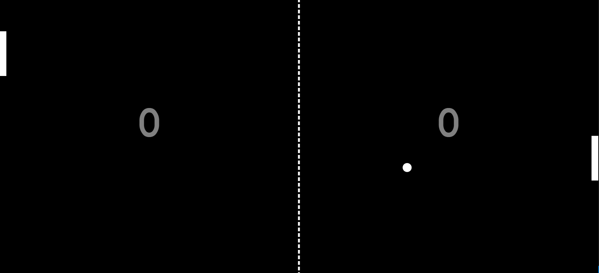

# treino de JS

**Jogo de Pong**  
Este tutorial é baseado nas aulas do (ASMR Programming). Vou ensinar como criar um jogo de Pong usando JavaScript. O projeto é uma versão de pingue-pongue que você pode jogar com o código em JavaScript! ❗️

**Facilitando o Jogo**  
Se você quiser tornar o jogo mais fácil, uma boa opção é ajustar a velocidade da raquete do computador, tornando-a menos ágil no acompanhamento da bola. Para isso, basta modificar a linha `com.y += (ball.y - (com.y + com.height / 2)) * 0.1;` na função `update()`. Ao reduzir o valor de `0.1` para um número menor, a raquete do computador vai se mover mais devagar, tornando o jogo mais simples de ganhar. Veja um exemplo abaixo, com um fator reduzido para `0.05`:
```javascript
// Atualize a lógica do jogo
function update() {
  // Verifique a pontuação e reinicie a bola, se necessário
  if (ball.x - ball.radius < 0) {
    com.score++;
    resetBall();
  } else if (ball.x + ball.radius > canvas.width) {
    user.score++;
    resetBall();
  }

  // Update ball position
  ball.x += ball.velocityX;
  ball.y += ball.velocityY;

  // Atualize a posição da raquete do computador com base na posição da bola (ajustada para velocidade mais lenta)
  com.y += (ball.y - (com.y + com.height / 2)) * 0.05;

  // Reflita a bola nas paredes superior e inferior
  if (ball.y - ball.radius < 0 || ball.y + ball.radius > canvas.height) {
    ball.velocityY = -ball.velocityY;
  }

  // Determine qual raquete está sendo atingida pela bola e controle a colisão
  let player = ball.x + ball.radius < canvas.width / 2 ? user : com;
  if (collision(ball, player)) {
    const collidePoint = ball.y - (player.y + player.height / 2);
    const collisionAngle = (Math.PI / 4) * (collidePoint / (player.height / 2));
    const direction = ball.x + ball.radius < canvas.width / 2 ? 1 : -1;
    ball.velocityX = direction * ball.speed * Math.cos(collisionAngle);
    ball.velocityY = ball.speed * Math.sin(collisionAngle);

    // Aumente a velocidade da bola e limite a velocidade máxima
    ball.speed += 0.2;
    if (ball.speed > maxBallSpeed) {
      ball.speed = maxBallSpeed;
    }
  }
}
```
##

# Screenshot
A seguir, temos uma imagem do projeto finalizado e em funcionamento: :


